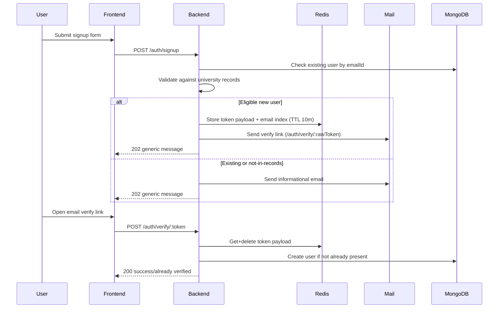
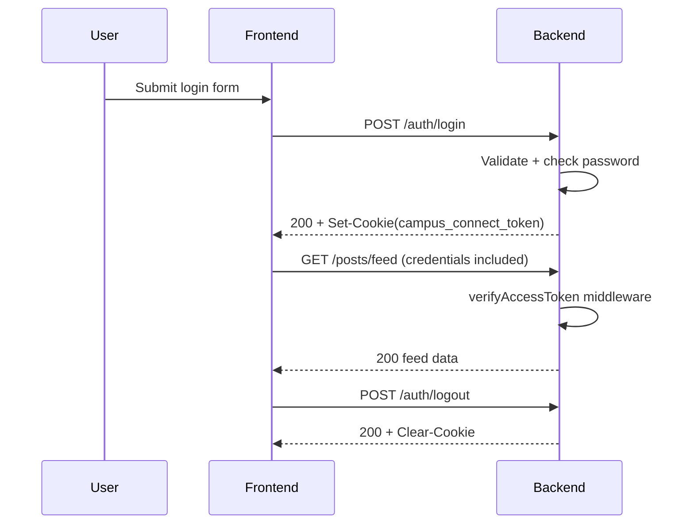
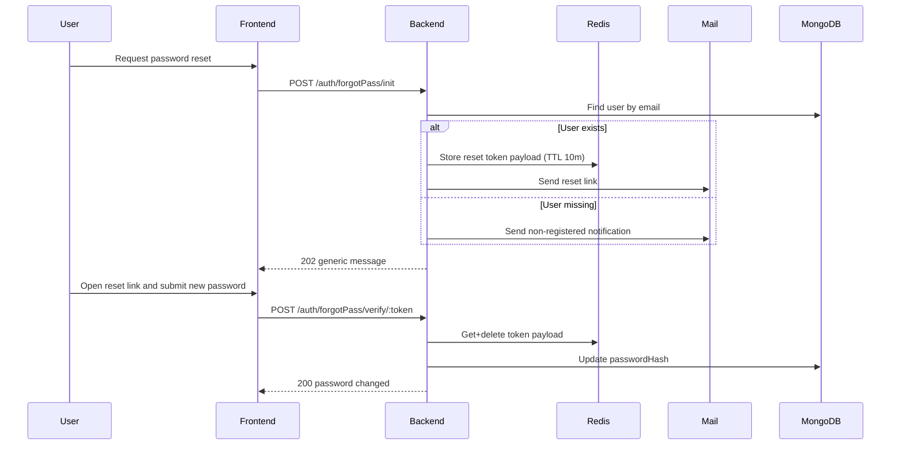

# Campus Connect Registration and Authentication Flow

This document explains the current end-to-end auth flow implemented across:

- `backend/` (Express + MongoDB + Redis)
- `frontend/` (React + Vite)

It covers signup, email verification, login, guest login, session cookie behavior, protected API usage, logout, and forgot-password reset.

## 1. High-level architecture

### Backend auth building blocks

- Auth routes are under `/auth`.
- User accounts are stored in MongoDB (`users` collection).
- One-time verification/reset tokens are stored in Redis.
- Login state is maintained with an HTTP-only JWT cookie: `campus_connect_token`.
- Outbound mail uses SMTP (Gmail transport) via NodeMailer.

### Frontend auth building blocks

- All auth calls use `fetch` with `credentials: "include"`.
- Every auth request (except logout) adds `x-device-fingerprint`.
- Auth pages:
  - `/auth/signup`
  - `/auth/verify/:token`
  - `/auth/login`
  - `/auth/forgotPass/init`
  - `/auth/forgotPass/verify/:token`
- App pages (`/app`, `/app/departments`) rely on backend 401/403 and redirect on failure.

## 2. Auth API surface

### Auth endpoints

- `POST /auth/signup` -> start registration
- `POST /auth/verify/resend` -> resend signup verification mail
- `POST /auth/verify/:token` -> finalize signup using token
- `POST /auth/login` -> issue session cookie
- `POST /auth/guestLogin` -> guest session cookie
- `POST /auth/logout` -> clear session cookie
- `POST /auth/forgotPass/init` -> send reset email
- `POST /auth/forgotPass/verify/:token` -> set new password

### Protected resource endpoints (session required)

- `GET /departments`
- `GET /departments/subscriptions`
- `GET /departments/:id/subscribe`
- `GET /posts/feed`
- `GET /posts/:id`
- `POST /posts` (also role-restricted)
- `DELETE /posts/:id`

Public (no auth cookie needed):

- `GET /posts/public/preview`
- `GET /posts/department/:departmentId`

## 3. Identifier and role model

Two role-specific login/signup identities are supported:

- `student`: submit `enrollmentNumber` (frontend uppercases it)
- `senior`: submit `emailId` (frontend lowercases it)

On backend, student login/signup converts to university email:

- `emailId = enrollmentNumber.toLowerCase() + "@curaj.ac.in"`

User records include (important auth fields):

- `emailId` (unique)
- `passwordHash`
- `role`
- `roleLevel` (derived from role)
- role-specific fields:
  - student: `dob`, `enrollmentNumber`
  - senior: `employeeId`, `designation`

## 4. Validation, sanitization, and anti-enumeration behavior

Backend uses express-validator in `authValidation.js` with:

- allowlist body sanitization (unknown keys stripped)
- strict role/identifier format validation
- token format validation (`64` hex chars)
- strong password policy for signup + password reset

Error responses are intentionally generic to reduce account enumeration risk:

- signup/forgot init: usually `Bad request` for malformed input
- login: `Invalid credentials`
- token endpoints: `Invalid token`

Even when account does not exist, signup/forgot init usually returns success-like `202` with:

- `Please check your email inbox for further instructions`

This is deliberate to avoid disclosing user existence.

## 5. Rate limiting and abuse controls

The backend applies Redis-backed limiters:

- `loginLimiter`: 10 attempts / 15 min per account-like key
- `signupLimiter`: 10 attempts / 15 min per account-like key
- `ipCeilingLimiter`: 30 requests / hour per IP for signup-related flows
- `guestLimiter`: 150 requests / 15 min using device fingerprint (fallback IP)
- `authLimiter`: 200 requests / 15 min for authenticated routes

Signup resend also has Redis cooldown:

- key prefix: `signup:resend:cooldown:`
- cooldown: 30 seconds per email

## 6. Registration flow (signup + verify)

## 6.1 Signup initiation (`POST /auth/signup`)

Frontend (`/auth/signup`) sends:

- `role`
- identifier (`enrollmentNumber` or `emailId`)
- `password`

Backend path:

1. Validate/sanitize body.
2. Resolve identity:
   - student: derive email from enrollment number
   - senior: use submitted university email
3. Check university record source (`university_data.json`):
   - students list for student
   - seniors list for senior
4. Hash password with bcrypt (`salt rounds = 10`).
5. Branch behavior:
   - If user already exists in DB:
     - send "already registered" email
     - return `202`
   - If user not in university records:
     - send "not in records" email
     - return `202`
   - Else (eligible new user):
     - generate token pair: `rawToken` + `sha256(rawToken)`
     - store payload in Redis with TTL (10 min)
     - store email -> tokenHash index for resend support
     - email verification link: `FRONTEND_BASE_URL/auth/verify/:rawToken`
     - return `202`

## 6.2 Signup resend (`POST /auth/verify/resend`)

Frontend uses payload saved after successful signup-init submission (no password re-entry).

Backend path:

1. Validate role + identifier.
2. Enforce 30-second resend cooldown per email.
3. If account already exists:
   - send already-registered email
   - return `202`
4. If identifier not in university records:
   - send not-in-records email
   - return `202`
5. If pending signup token exists:
   - refresh TTL for token and email-index keys
   - resend same verification URL (stored raw token)
6. Return `202` in all normal branches.

## 6.3 Signup verify (`POST /auth/verify/:token`)

Frontend `/auth/verify/:token` auto-calls verify on page load.

Backend path:

1. Validate token shape (64-char hex).
2. Hash token with SHA-256 and lookup Redis entry.
3. Delete token key after successful read (one-time use semantics).
4. If token invalid/expired -> `400 Invalid or expired token`.
5. Build final user record from pending payload.
6. If user already exists (or duplicate insert race) -> `200 User already verified. Please log in.`
7. Else create Mongo user -> `200 User registered successfully`.

## 7. Login flow

## 7.1 Standard login (`POST /auth/login`)

Frontend `/auth/login` sends:

- `role`
- identifier
- `password`

Backend path:

1. Validate/sanitize input with generic error messaging.
2. Resolve user email from role + identifier.
3. Find user by `emailId`.
4. Compare submitted password vs `passwordHash` using bcrypt.
5. On success:
   - sign JWT (1 hour expiry) with claims: `emailId`, `_id`, `role`
   - set cookie `campus_connect_token`
   - return `200 Login successful`
6. On failure: `401 Invalid credentials`.

### Cookie properties

Cookie options are environment-dependent:

- Always: `httpOnly: true`, `path: /`
- Production:
  - `secure: true`
  - `sameSite: none`
- Development:
  - `secure: false`
  - `sameSite: lax`
- Expiry: 1 hour (`maxAge`)

## 7.2 Guest login (`POST /auth/guestLogin`)

- Issues JWT for role `guest` (1 hour)
- Stores same auth cookie name
- Frontend treats success the same as normal login and navigates to `/app`

## 8. Session use on protected routes

Protected routes use middleware `verifyAccessToken`:

1. Read `campus_connect_token` cookie.
2. Verify JWT signature/expiry.
3. Attach `req.user` and normalize `userId` from `_id` if needed.
4. Reject with:
   - `401 unauthorised` if missing/invalid
   - `401 session expired` when token is expired

Additional role guard exists for privileged endpoints:

- `requireRole("senior", "dept_admin", "univ_admin")` for `POST /posts`

Frontend handling:

- API wrappers throw on non-2xx.
- Pages like Feed/Home catch `401` and redirect to `/auth/login`.
- `403` is handled specifically in some UI paths (ex: guest cannot manage subscriptions).

## 9. Logout flow

Frontend calls `POST /auth/logout`.

Backend:

- clears `campus_connect_token` using same base cookie options
- returns `200 Logged out`

Frontend then redirects user to `/auth/login`.

## 10. Forgot password flow

## 10.1 Forgot init (`POST /auth/forgotPass/init`)

Frontend `/auth/forgotPass/init` sends role + identifier.

Backend path:

1. Validate/sanitize role + identifier.
2. Resolve target email.
3. If user does not exist:
   - send not-registered reset email
   - return `202` generic message
4. If user exists:
   - generate reset token
   - store payload in Redis (includes previous password hash)
   - send reset URL: `FRONTEND_BASE_URL/auth/forgotPass/verify/:rawToken`
   - return `202` generic message

## 10.2 Forgot verify (`POST /auth/forgotPass/verify/:token`)

Frontend `/auth/forgotPass/verify/:token`:

- validates token format locally
- validates strong password + confirm match
- submits new password

Backend path:

1. Validate token format and new password strength.
2. Resolve token payload from Redis via SHA-256 hash.
3. Delete token key on successful read.
4. Reject if token invalid/expired.
5. Check password reuse with `bcrypt.compare(newPassword, oldHash)`.
6. If reused -> `400 Cannot use the old password again`.
7. Else hash new password and update user record.
8. Return `200 Password changed successfully`.

## 11. Frontend route and state transitions

- Landing page (`/`) offers Log in and Sign up.
- Signup page enters post-submit state after `202` response:
  - shows generic success message
  - offers login, signup again, resend verification
- Signup verify page auto-verifies from URL token.
- Login page supports both normal and guest login.
- Forgot init sends reset email flow.
- Forgot verify page completes password reset then navigates to login.
- App routes (`/app`, `/app/departments`) are not protected by router-level guard; protection is API-driven via backend 401/403.

## 12. Sequence diagrams

### Signup and verify

### Login and protected API access

### Forgot password

## 13. Important implementation notes

- Auth cookie persistence requires both sides aligned:
  - backend CORS with explicit `origin` + `credentials: true`
  - frontend fetch with `credentials: "include"`
- Token links are one-time and short-lived because Redis key is deleted on successful verify.
- Signup and forgot-password initiation intentionally mask account existence using `202` + generic message.
- Frontend performs local validation first, but backend remains the source of truth.

## 14. Quick trace map (file pointers)

Backend:

- `backend/routes/authRouter.js`
- `backend/controller/authController.js`
- `backend/middleware/authValidation.js`
- `backend/middleware/verifyAccessToken.js`
- `backend/middleware/rateLimiters.js`
- `backend/services/verificationToken.js`
- `backend/config/mail.js`
- `backend/tamplates/mailTemplates.js`
- `backend/models/user.js`
- `backend/index.js`

Frontend:

- `frontend/src/lib/api.js`
- `frontend/src/lib/authValidators.js`
- `frontend/src/lib/clientKey.js`
- `frontend/src/lib/authSession.js`
- `frontend/src/pages/Signup.jsx`
- `frontend/src/pages/SignupVerify.jsx`
- `frontend/src/pages/Login.jsx`
- `frontend/src/pages/ForgotPasswordInit.jsx`
- `frontend/src/pages/ForgotPasswordVerify.jsx`
- `frontend/src/App.jsx`
